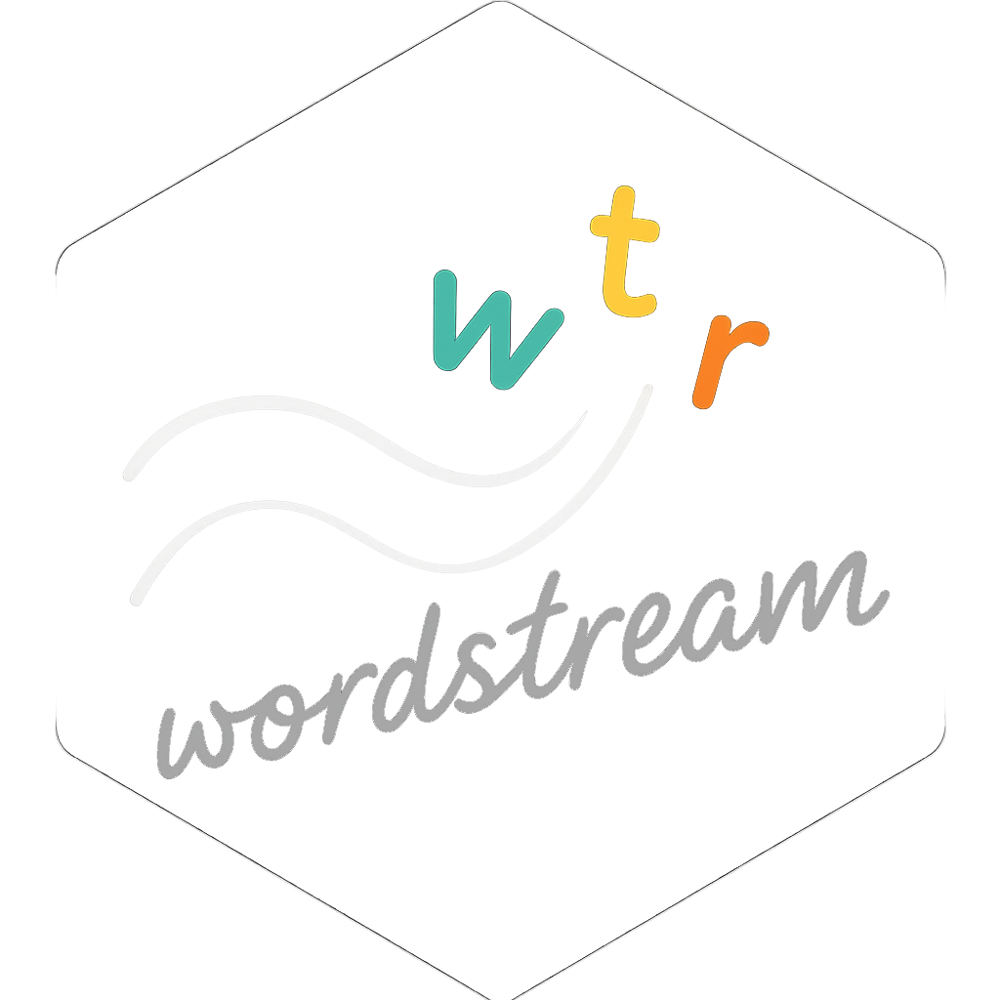
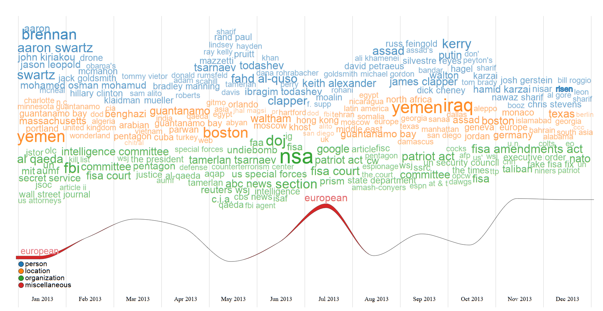

<!-- README.md is generated from README.Rmd. Please edit that file -->

```{r, include = FALSE}
knitr::opts_chunk$set(
  collapse = TRUE,
  comment = "#>",
  fig.path = "man/figures/README-",
  out.width = "100%"
)
```

# wordstreamr 

<!-- badges: start -->
[](https://CRAN.R-project.org/package=wordstreamr)
[](https://github.com/distintivelab/wordstreamr/actions/workflows/check.yaml)
[](https://app.codecov.io/gh/distintivelab/wordstreamr)
[](https://lifecycle.r-lib.org/articles/stages.html#experimental)
<!-- badges: end -->

`wordstreamr` provides a flexible data processing pipeline to extract and prepare text from sources like PDF files. This includes functionalities for term extraction (n-grams), stemming, and stopword filtering. Optionally, it can leverage Large Language Models (LLMs) for advanced, automated categorization of the identified terms.

O objetivo do `wordstreamr` é criar visualizações 'WordStream' como `htmlwidgets` para ilustrar a evolução de tópicos ao longo do tempo.

Cria visualizações 'WordStream' como 'htmlwidgets' para ilustrar a evolução de tópicos ao longo do tempo. O pacote oferece um pipeline flexível de processamento de dados para extrair e preparar texto a partir de fontes como arquivos PDF. Isto inclui funcionalidades para extração de termos (n-grams), radicalização (stemming) e filtragem de stopwords. Opcionalmente, pode utilizar Modelos de Linguagem Grandes (LLMs) para a categorização avançada e automática dos termos identificados.



*Exemplo de uma visualização WordStream gerada com o pacote.*

## Key Features

*   **`wordstream()`:** A principal função de visualização que aceita dados pré-formatados e renderiza um htmlwidget interativo.
*   **`prepare_wordstream_data()`:** Uma função auxiliar para converter data frames em formato "tidy" para a estrutura de lista aninhada exigida pela visualização.
*   **`process_pdfs_for_wordstream()`:** Um pipeline completo de NLP para usuários que começam com uma coleção de documentos PDF. Extrai texto e datas, identifica termos relevantes e os prepara para análise.
*   **LLM Integration:** Capacidade opcional de usar LLMs (via `ollamar` ou `chatLLM`) para categorizar automaticamente os termos extraídos por tema, Part-of-Speech (POS) ou Named-Entity Recognition (NER).

## Installation

Você pode instalar a versão de desenvolvimento do `wordstreamr` a partir do [GitHub](https://github.com) com:

```r
# install.packages("devtools")
devtools::install_github("seu-usuario-github/wordstreamr")
```

## Workflow Básico

O pacote foi projetado para desacoplar o processamento de dados da visualização. O fluxo de trabalho típico envolve preparar seus dados primeiro e depois passá-los para a função de visualização.

### 1. Preparar os Dados

Primeiro, você precisa de um data frame em formato "tidy", onde cada linha representa uma palavra (ou termo) em um determinado momento e pertencente a um grupo.

```{r example-data}
library(wordstreamr)
library(dplyr)
library(tibble)

# Criar um corpus de exemplo em formato tidy
set.seed(123)
tidy_corpus <- tibble(
  Semana = rep(c("Semana 1", "Semana 2", "Semana 3", "Semana 4"), each = 50),
  Termo = sample(c("dados", "visualização", "análise", "projeto", "ciência", "curso", "novo", "bom", "api", "relatório"), 200, replace = TRUE),
  Categoria = sample(c("Técnico", "Negócios"), 200, replace = TRUE, prob = c(0.7, 0.3))
)

head(tidy_corpus)
```

Em seguida, use a função `prepare_wordstream_data()` para contar as frequências e formatar os dados para a visualização.

```{r prepare-data}
# Converter o data frame para o formato de lista aninhada
prepared_data <- prepare_wordstream_data(
  data = tidy_corpus,
  time_col = "Semana",
  group_col = "Categoria",
  word_col = "Termo",
  top_n = 50 # Manter os 50 termos mais comuns por grupo/semana
)
```

### 2. Gerar a Visualização

Finalmente, passe os dados preparados para a função `wordstream()`.

```{r create-widget, eval=FALSE}
# Gerar o htmlwidget
wordstream(
  data = prepared_data,
  width = "100%",
  height = "600px",
  max_font_size = 50
)
```

Este código irá renderizar a visualização WordStream diretamente no seu visualizador do RStudio, em um notebook R Markdown ou em uma aplicação Shiny.

## Fluxo de Trabalho Avançado: De PDFs à Visualização

Para usuários que começam com uma coleção de documentos, a função `process_pdfs_for_wordstream()` automatiza a extração e análise.

O exemplo abaixo mostra um fluxo de trabalho conceitual. Para executá-lo, você precisaria de uma pasta chamada `"meus_pdfs/"` com arquivos PDF dentro e um provedor de LLM configurado (como o [Ollama](https://ollama.com/) rodando localmente).

```{r advanced-workflow, eval=FALSE}
# Passo 1: Processar uma pasta de PDFs, extrair termos e categorizá-los
# usando um LLM para Named-Entity Recognition (NER).
tidy_terms_from_pdfs <- process_pdfs_for_wordstream(
  folder_path = "meus_pdfs/",
  language = "pt",
  ngram_range = 1:2, # Extrai palavras e bigramas
  top_n_words = 200,
  categories = "ner", # Usa o LLM para categorizar como Pessoa, Organização, etc.
  llm_provider = "ollamar"
)

# O resultado é um data frame tidy pronto para o próximo passo
# Colunas: term, frequency, category

# Passo 2: Preparar os dados para a visualização
# Note que as colunas já têm os nomes esperados
prepared_pdf_data <- prepare_wordstream_data(
  data = tidy_terms_from_pdfs,
  time_col = "date", # A função extrai a data do PDF
  group_col = "category", # A categoria foi criada pelo LLM
  word_col = "term"
)

# Passo 3: Visualizar o resultado
wordstream(
  data = prepared_pdf_data,
  height = "800px"
)
```

Este fluxo de trabalho demonstra o poder do pacote para transformar documentos não estruturados em uma visualização interativa com poucas linhas de código.

## Licença

Este pacote está licenciado sob os termos da licença GPL-3.
